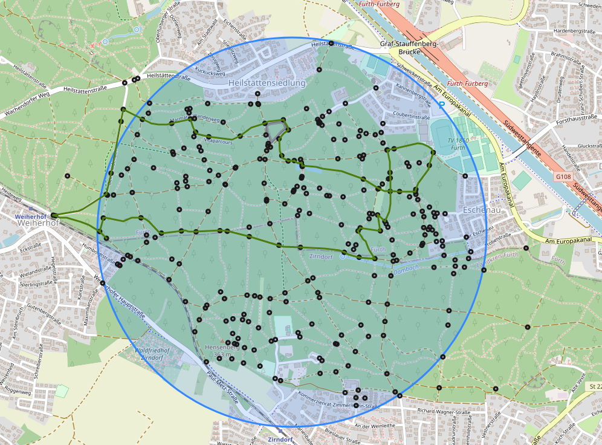
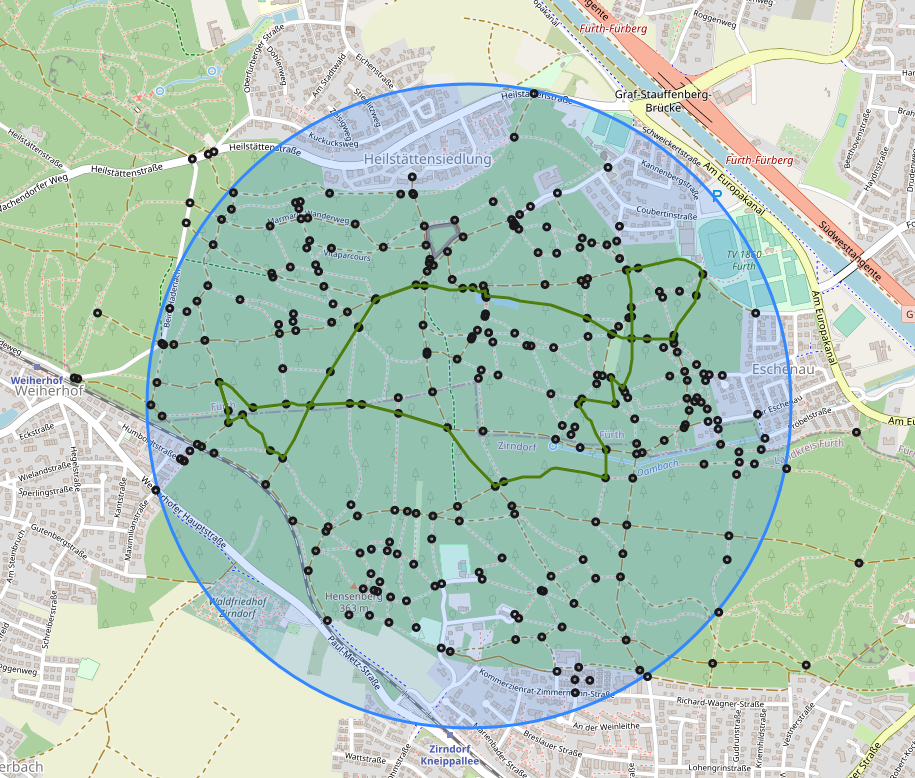
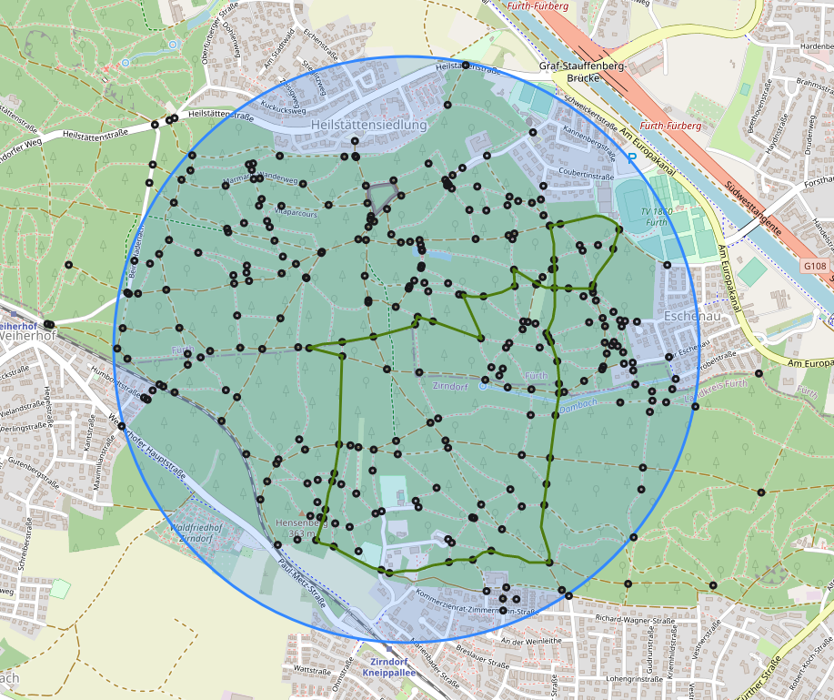

# Randowalker

A prototype for generating random walks in a specific area with a fixed starting point

## To do

- Use of the Dijkstra algorithm for better avoidance of duplicate sections in a walk
- Optional removal of dead ends
- Refactoring and improvement of the UI and user guidance
- Display more information about a route
- Export

